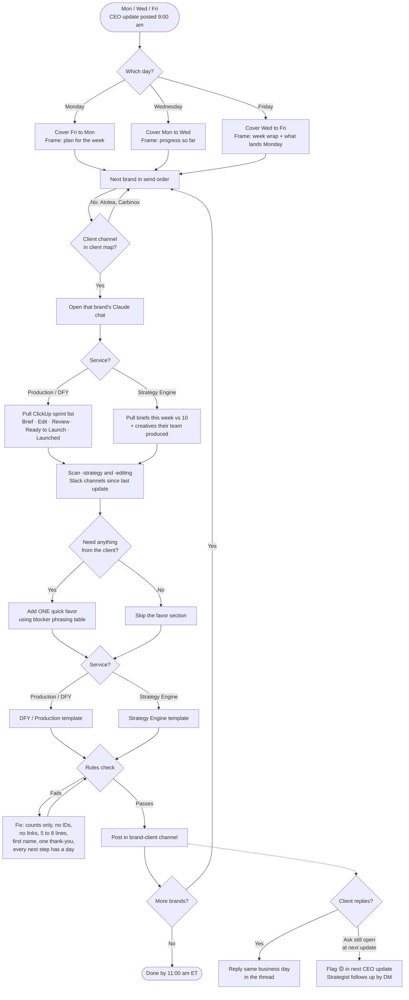

# Client Update Flow (Mon / Wed / Fri)

The order we send client updates, brand by brand. Templates and phrasing live in `2-client-update.md`. Contacts and channels live in the client map in `3-morning-routine.md`.

## When

- Monday, Wednesday, Friday.
- Start after the CEO update is posted in #ops-team (9:00 am), so blockers already have owners.
- All client updates out by 11:00 am ET.

## Send order

Delivery clients go first. Their updates usually carry a feedback ask, and asking early gives the client the whole day to answer.

| # | Brand | Service | Contact | Post in | Template |
|---|---|---|---|---|---|
| 1 | Ivy Food Scanning App | Production | Ramzy | #ivy-client | DFY / Production |
| 2 | Earthling Co | DFY | Kevin | #earthlingco-client | DFY / Production |
| 3 | Hommey | DFY | Jessica, Justin | #hommey-client | DFY / Production |
| 4 | Madam Muse | SE | Ronan | #madammuse-client | Strategy Engine |
| 5 | Tulas | SE | Nicolas | #tulas-client | Strategy Engine |
| 6 | LuxFord Tech | SE | Jordan | #luxfordtech-client | Strategy Engine |
| 7 | Longwell & Co | SE | Saru | #longwellco-client | Strategy Engine |
| 8 | Napper | SE | Marcus | #napper-client | Strategy Engine |
| skip | Atolea, Carbinox | SE | n/a | no client channel | none |

Inside a service, a 🔴 or 🟡 brand from today's CEO update moves to the top.

## Flowchart

## Day focus

| Day | Covers | Lead with | Close with |
|---|---|---|---|
| Monday | Fri to Mon | What's ready now | What lands this week, by day |
| Wednesday | Mon to Wed | What moved since Monday | What lands by Friday |
| Friday | Wed to Fri | The week's total ready or produced | What lands Monday |

## Per-brand checklist

1. Counts pulled (ClickUp for DFY and Production, briefs vs 10 for SE).
2. Slack scanned for anything waiting on the client.
3. Right template for the service.
4. One ask at most, with the reason it helps them.
5. Rules pass: counts only, no links, 5 to 8 lines, first name, something specific to thank them for.
6. Posted in the brand's client channel.
